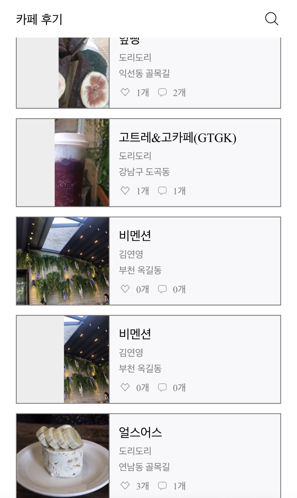

# ReadMe

# 프로젝트 소개

- [시연 영상 링크](https://www.youtube.com/watch?v=vKbf85SGfvQ)
- 팀소개
    - [팀노션링크](https://www.notion.so/CAFE-WANG-2cbfbbcf11fc4db4988e55b78a55997c)
    - 백엔드: 배나영, 양희준, 홍재환   [깃허브링크](https://www.notion.so/CAFE-WANG-2cbfbbcf11fc4db4988e55b78a55997c)
    - 프론트: 노강표, 박하린, 이성민   [깃허브링크](https://www.notion.so/CAFE-WANG-2cbfbbcf11fc4db4988e55b78a55997c)

# 개발 환경

- 백엔드 기술스택
    - Java 11
    - SpringBoot 2.5.6
    - Spring Security
    - Gradle 7.2
    - JPA
    - QueryDSL
    - MySQL 8.0
- 협업툴
  
    Github
    
- 아키텍쳐
  
    클라이언트 서버와 SSL 인증 적용한 HTTPS 통신
    
    - AWS EC2 (ubuntu)
    - AWS RDS (MySQL 8.0)
    - AWS S3
    - Nginx
    
    

## 메인기능

- 카페 추천기능
    - 사용자의 시간대별(아침,점심,저녁,밤,새벽) 활동기록 바탕으로 카페추천
    - 사용자 앱 사용활동 기록 트래킹
- 카페추천, 자유게시판
    - 다중 사진 업로드, 수정
    - 썸네일 이미지 resizing
    - 댓글 작성, 댓글 좋아요 기능
    - 좋아요 기능
- 카페왕 랭킹 시스템
    - 저번 주에 활동한 데이터를 기반으로 게시물 수, 팔로워 수, 좋아요 수, 댓글 수 별 1등 사용자를 카페왕으로 선정
    - 이번주 실시간 랭킹 TOP3 표시
    - 스케쥴러를 활용한 카페왕 적용
    - 카페왕의 게시물에 왕관 표시
- 팔로우 기능
    - 관심있는 사용자 팔로우 기능
    - 팔로워, 팔로잉 유저 목록 조회기능
- 로그인 기능
    - JWT, 카카오 소셜 로그인

## 배포버전

# ERD

# 기술적 고민들

## 1. 양방향 연관관계와 cascade 옵션 관련

희준님 블로그 정리: [https://lovenewthing.tistory.com/37](https://lovenewthing.tistory.com/37)

- 문제 상황 및 원인
  
    단방향 연관관계만으로 설정된 상황에서, 자식의 객체를 삭제를 할 수없는 상황 발생.
    
- 원인
  
    '**Recipe에서 자기를 사용자들이 몇번이나 상세조회했는지 알 필요는 없으니까 양방향은 필요없어'** 라고 생각하여 단방향으로만 관계를 맺었음. 그러나, 레시피를 삭제할 때 레시피만 삭제하면, RecipeDetailCount엔티티와 테이블에서는 이 데이터베이스세상에 존재하지 않는 레시피를 누군가 방문했다는 모양이 되어 버림.
    
- 해결방법
    1. Recipe삭제 시 RecipeDetailCount에서도 삭제하는 쿼리를 날리기
    2. 영속성 상태관리를 동일하게 유지
    
    중 2번째 방법 선택함.(관련 커밋: https://github.com/15-cafewang/back-end/pull/66/commits/3e5ef2572c2ac917fd8c11df05835e1c7769e0e4)

## 2. 확장 가능성, 유지보수를 고려한 DB 모델링

희준님 블로그 정리: [https://lovenewthing.tistory.com/25](https://lovenewthing.tistory.com/25)

1. 카페테이블과 게시물테이블의 내용이 비슷하니까 그냥 '게시물'이란 테이블 하나에다가 넣어서 관리하는게 나을지
    - 고민과 해결:
      
        같은 테이블을 쓰면 추후에 기획이 바뀌거나 카페테이블에만 속성을 추가하고 싶을 때 문제가 발생한다. 확장가능성을 고려할 때 각각 다른 테이블을 쓰는 것이 좋다고 결론.
    
2. 한 테이블에서 좋아요에 관한 것을 모두 관리할지
    - 고민과 해결:
      
        사업이 확장되고 기획이 바뀜에 따라 칼럼이 늘어날 텐데, 해당 칼럼이 아닌것은 모두 null을 가지게 된다. 미래를 위해 각각의 대상에 대한 좋아요 테이블을 따로 만들기로 결론
    
3. 여러개의 태그를 등록할 때 따로 테이블을 만들지, 아니면 칼럼 하나를 추가하여 문자열로 넣을지
    - 칼럼에 문자열로 ,(콤마) 등의 기호로 구분하면 나중에 해당 태그를 기준으로 join을 할수가 없게 되므로, 태그에 대한 테이블을 따로 생성하기로 결론

## 3. 게시물 다중 사진 수정로직 변경로직

희준님 블로그 정리: [https://lovenewthing.tistory.com/32?category=877529](https://lovenewthing.tistory.com/32?category=877529), 

나영님 블로그 정리: [https://nazero.tistory.com/129](https://nazero.tistory.com/129)

- 기존 문제점
  
    게시물 수정 시 기존 사진을 다시 올리지 않으면 삭제되는 상황 발생
    
- 해결 방식
    - 사용자로부터 삭제할 사진을 선택하도록 하여, 프론트에서 삭제할 사진들의 url과 추가할 사진을 form-data로 분리하여 받도록 함.

## 4. 사용자 활동 추적하여 카페 추천하기

희준님 블로그 정리: [https://lovenewthing.tistory.com/41](https://lovenewthing.tistory.com/41)

- 상황:
  
    카페추천기능을 넣기로 하는 기획이 개발 도중에 추가됨
    
- 목표 로직
    1. 사용자 접속 시간대 분류(아침,점심,저녁,밤,새벽)
    2. 사용자 활동기록 디비에 저장
    3. 관심있어한 게시물의 태그와 시간대를 바탕으로 게시물 추천
- 해결과제: 추천하기 위한 데이터가 필요함
    - 필요한 정보를 쌓기 위한 디비 생성
        - **어떤 사용자**가**, 언제, 어떤 태그로 검색**했는지 알기 위한 디비
          
            → 검색 api 호출시마다 작동
            
        - **어떤 사용자**가, **언제**, **어떤 게시물을, 몇번 상세조회**하였는지 알기 위한 디비 생성
          
            → 상세조회 api호출시마다 작동
            
        - **어떤 사용자**가 **언제**, **어떤 게시물을 좋아요** 하였는지 알기 위한 디비
          
            → 좋아요 api호출시마다 작동
        
    - 트러블 슈팅
        - 문제:
          
            시간대를 나누는 과정에서, 밤 12시가 넘어도 새벽 4시 이전까지는 오늘로 인식해야 함.그러나 밤 12시가 지났기에 새벽 1시만 되어도 내일로 인식하는 문제점 발생.
            
        - 해결:
          
            기존 코드를 테스트하기 좋은 코드로 개선 후(메소드에 인자 받도록 변형), 테스트코드에서 시간대별로 메소드가 잘 작동하는지 검사
            
            
            
            
            
        - 

## 5.HTTPS 적용하기

- HTTPS적용하기 위한 개념공부
  
    희준님 블로그 정리: [https://lovenewthing.tistory.com/42](https://lovenewthing.tistory.com/42)
    
    재환님 깃허브 정리: [https://github.com/jhhong0930/TIL/blob/master/Network/HTTPS.md](https://github.com/jhhong0930/TIL/blob/master/Network/HTTPS.md)
    
    - 암호화, 복호화 개념
    - 대칭키, 공개키 개념
    - SSL 인증서와 CA개념
    - SSL 동작방법- 3way handshake
- HTTPS를 카페왕 프로젝트에 적용하기 - 나영님 블로그 정리: [https://nazero.tistory.com/140](https://nazero.tistory.com/140)

## 6. 실시간 랭킹 업데이트 기능

재환님 깃허브정리: 

[https://github.com/jhhong0930/TIL/blob/master/문제해결/localDateTime을 활용한 실시간 랭킹 조회 기능.md](https://github.com/jhhong0930/TIL/blob/master/%EB%AC%B8%EC%A0%9C%ED%95%B4%EA%B2%B0/localDateTime%EC%9D%84%20%ED%99%9C%EC%9A%A9%ED%95%9C%20%EC%8B%A4%EC%8B%9C%EA%B0%84%20%EB%9E%AD%ED%82%B9%20%EC%A1%B0%ED%9A%8C%20%EA%B8%B0%EB%8A%A5.md)

- 문제: 삭제한 게시글, 좋아요, 팔로우는 실시간으로 반영이 잘 되는 반면 새로 추가되는 데이터들은 집계가 안되는 문제 발생
- 원인: now()를 이용하여 지금까지의 데이터들을 집계를 하게 되는데, LocalDateTime을 전역변수에 선언하여 서버 실행시 Bean에 등록이 되면서 현재시간이 아닌 서버 실행 시간으로 고정
- 해결: 시간을 불러오는 변수를 따로 함수로 만들어서 필요할때마다 새로 현재시간을 불러오게끔 수정

## 7. 사진 썸네일 리사이징

나영님 블로그 정리: [https://nazero.tistory.com/146](https://nazero.tistory.com/146)

- 문제 상황: 화면 렌더링 시간이 너무 오래 걸림
  
    
    
- 원인: 게시물 목록 조회 시 각 게시물마다 용량이 큰 원본 이미지를 불러옴
- 해결: 목록 조회 시 원본 이미지가 아닌 썸네일을 만들어 응답

## 9. 여러 장의 이미지 파일 다루기

나영님 블로그 정리: [https://nazero.tistory.com/122](https://nazero.tistory.com/122)

- 문제 상황: 게시물마다 한 장의 이미지만 첨부할 수 있었던 로직에서 여러 장의 이미지를 첨부할 수 있도록 변경해야 함
- 해결: requestDto에서 사진 한 장을 요청 받는 변수에서 여러 장을 요청 받을 수 있도록 MultipartFile 배열로 변경

## 10. 프론트에서 form-data 형식으로 API를 사용하는 방법

나영님 블로그 정리: [https://nazero.tistory.com/125](https://nazero.tistory.com/125)

- 문제 상황: 프론트에서 문자열을 request할 때는 별 다른 어려움이 없었지만, 이미지 파일을 포함한 form-data 형식으로 request하는 방법을 알고 있지 않아 요청을 보내지 못함
- 해결:
    1. 문자열은 form-data에 담지 않고, 이미지 파일만 form-data에 담아 요청을 보냄
       
        → 이미지 파일을 포함한 모든 데이터는 form-data에 담아 요청을 보내야 함
        
    2. 이미지 파일이 여러 장일 경우, 이미지 파일을 담은 배열을 form-data에 담아 요청을 보냄
       
        → 각 이미지 파일마다 'Key: Value' 형식을 맞춰 form-data에 담아 요청을 보내야 함